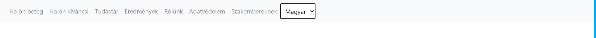

# navbar_translate_php
This small project demonstrates a more advanced way of translating website. 
Navigation bar translated to the selected language from mysql database. Using PHP, JQuery, Bootstrap.

## First state - In Hungarian the default language of the website

## Second state - select some language of the dropdown items

## Third state - the texts changed to the selected language
